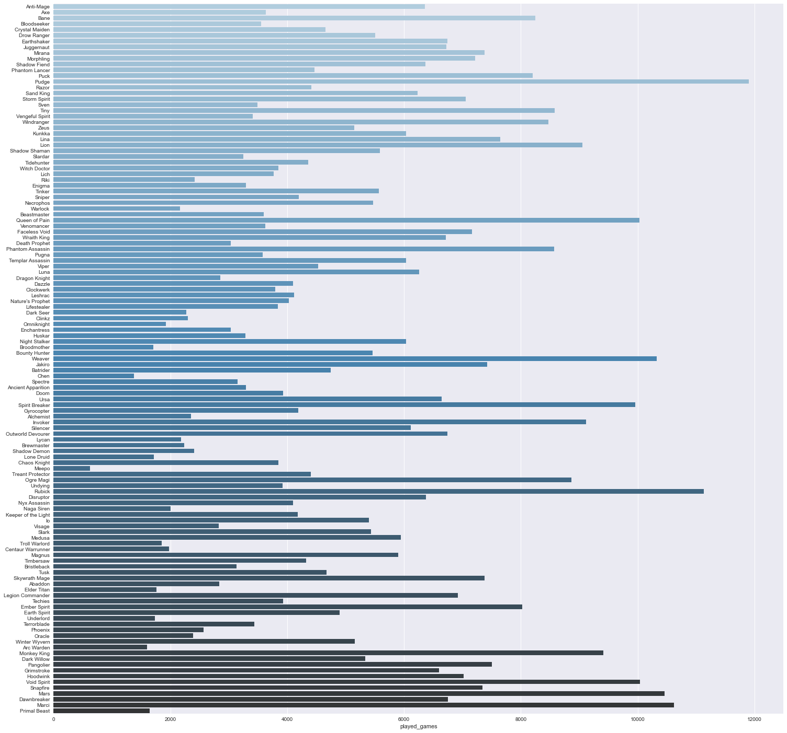
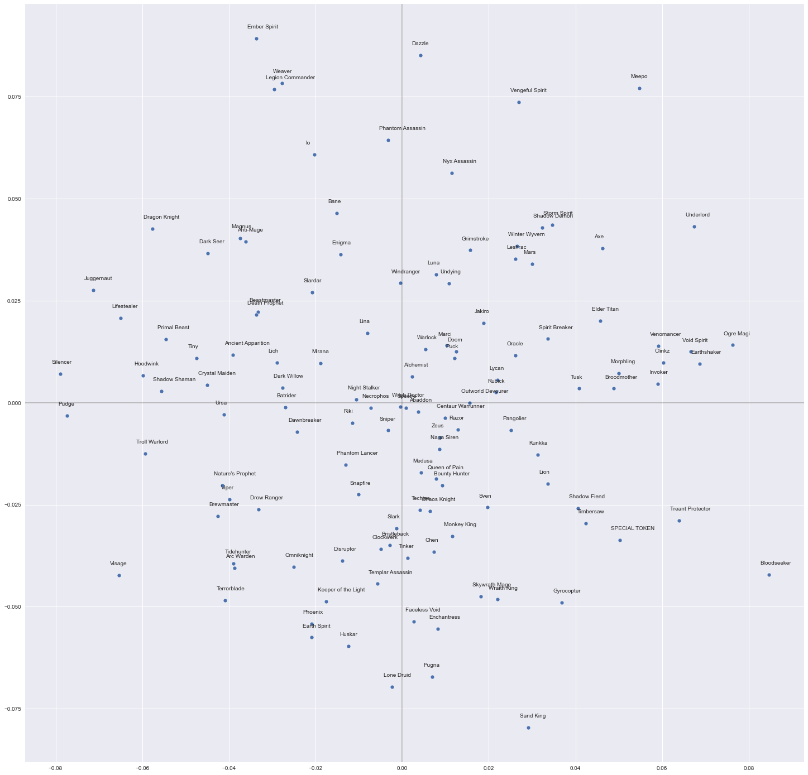
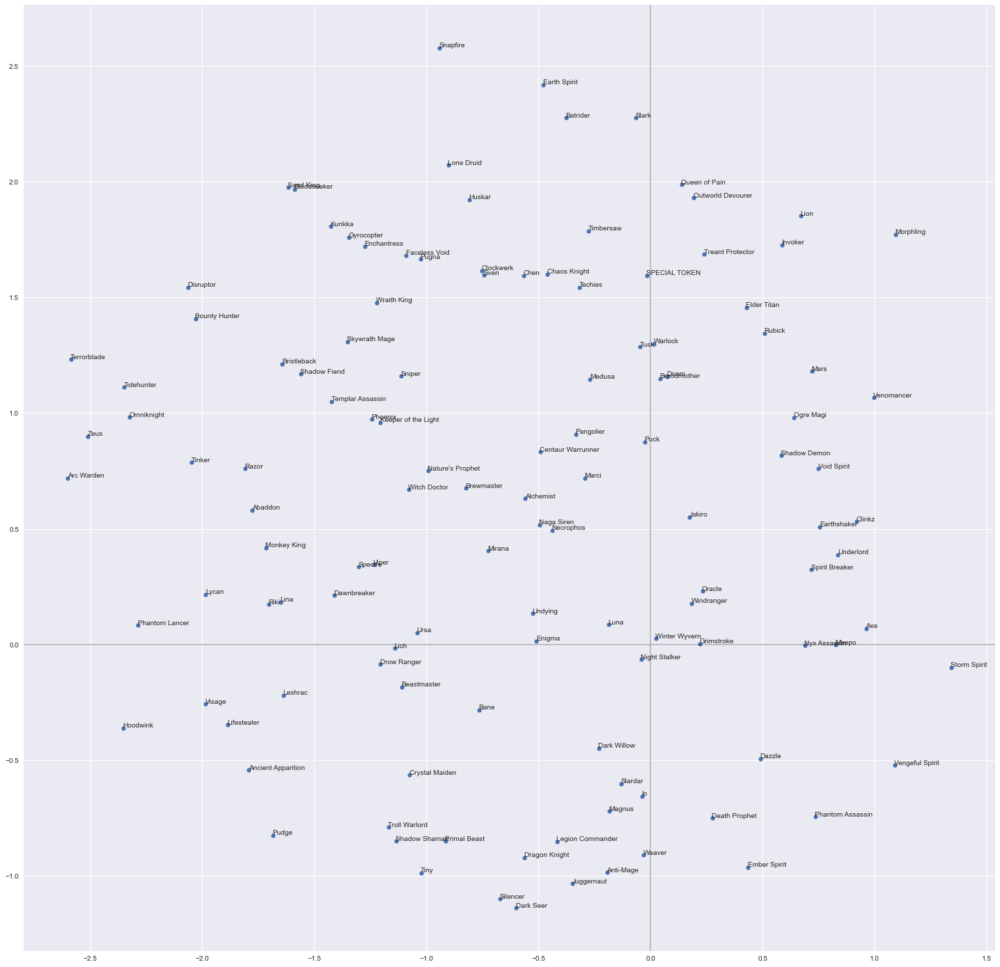

# Train pipelines

Folder with train pipelines

* train on public games - [public.py](public.py) / [public.ipynb](public.ipynb)
* train on league games - [league.py](league.py) / [league.ipynb](league.ipynb)

## Public overview

Quick comparison of two methods to ouctome (win) prediction - with pretrain and without pretrain:
ROCAUC without pretrain - 55.0 %
ROCAUC with pretrain    - 55.9 %
Δ - 0.9 %

Pretrain idea:
Feeds heroes, players, and rank tiers on input, excepts post-match statistics per team/player on output

### Evaluation

Hyperparameters vs Accuracy

| Hyper-parameter                        |        pretrain |                 |        pretrain |                 |
| :------------------------------------- | --------------: | --------------: | --------------: | --------------: |
| Hidden size                            |              32 |              32 |              64 |              64 |
| FFN inner hidden size                  |              64 |              64 |              64 |              64 |
| Attention Heads*                       |               4 |               4 |               4 |               4 |
| Encoder layer num                      |               4 |               4 |               4 |               4 |
| Dropout rate                           |             0.1 |             0.1 |             0.1 |             0.1 |
| Masking rate                           |            0.01 |            0.01 |            0.01 |            0.01 |
| Heroes embedding size                  |              16 |              16 |              16 |              16 |
| Players embedding size                 |              24 |              24 |              24 |              24 |
| Skip connection every N layer         |               4 |               4 |               4 |               4 |
| Batch size                             |            8192 |            8192 |            8192 |            8192 |
| Gradient Clipping                      |             1.5 |             1.5 |             1.5 |             1.5 |
| Weight Decay                           |            0.01 |            0.01 |            0.20 |            0.20 |
| Label smoothing                        |            0.15 |            0.15 |            0.10 |            0.10 |
| loss_weight: players_regression_output |            0.00 |            0.00 |            0.00 |            0.00 |
| loss_weight: l_output                  |            0.00 |            0.00 |            0.00 |            0.00 |
| loss_weight: r_output                  |            0.00 |            0.00 |            0.00 |            0.00 |
| loss_weight: teams_regression_output   |            0.25 |        *0.00* |            0.25 |        *0.00* |
| loss_weight: win_output                |            1.00 |            1.00 |            1.00 |            1.00 |
| Total trainable  params                |         114,015 |         114,015 |         359,359 |         359,359 |
| **Metric**                       | **Score** | **Score** | **Score** | **Score** |
| accuracy                               |          0.5377 |          0.5415 |     **0.5419** |          0.5372 |
| auc                                    |          0.5513 |          0.5500 |     **0.5598** |          0.5526 |
| log_loss                               |          0.6903 |          0.7054 |     **0.6891** |          0.6906 |
| precision                              |          0.5283 |          0.5307 |     **0.5343** |          0.5261 |
| recall                                 |          0.5589 |          0.5853 |          0.5347 |     **0.5961** |

*TensorFlow's multihead attention, so this works differently from PyTorch

### Charts

###### Pickrate

###### Heroes representation (Compressed with PCA)

###### Heroes representation (Compressed with TSNE)

## League overview

...
