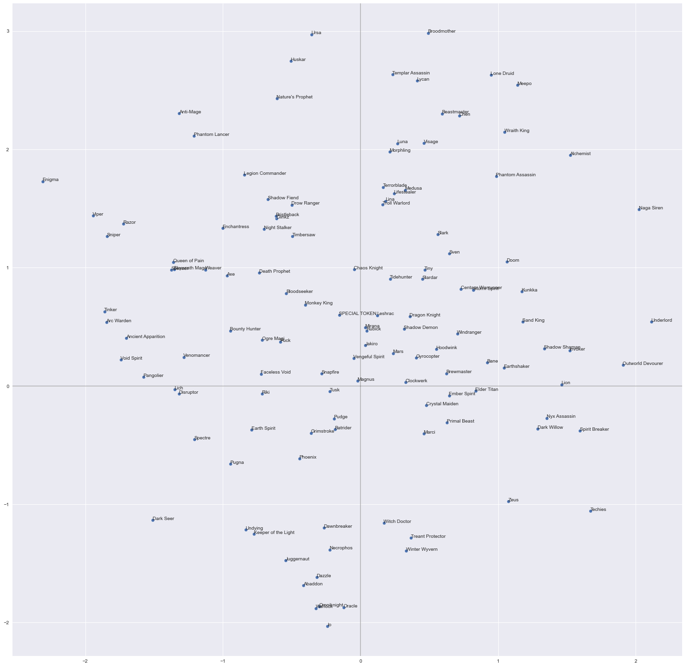
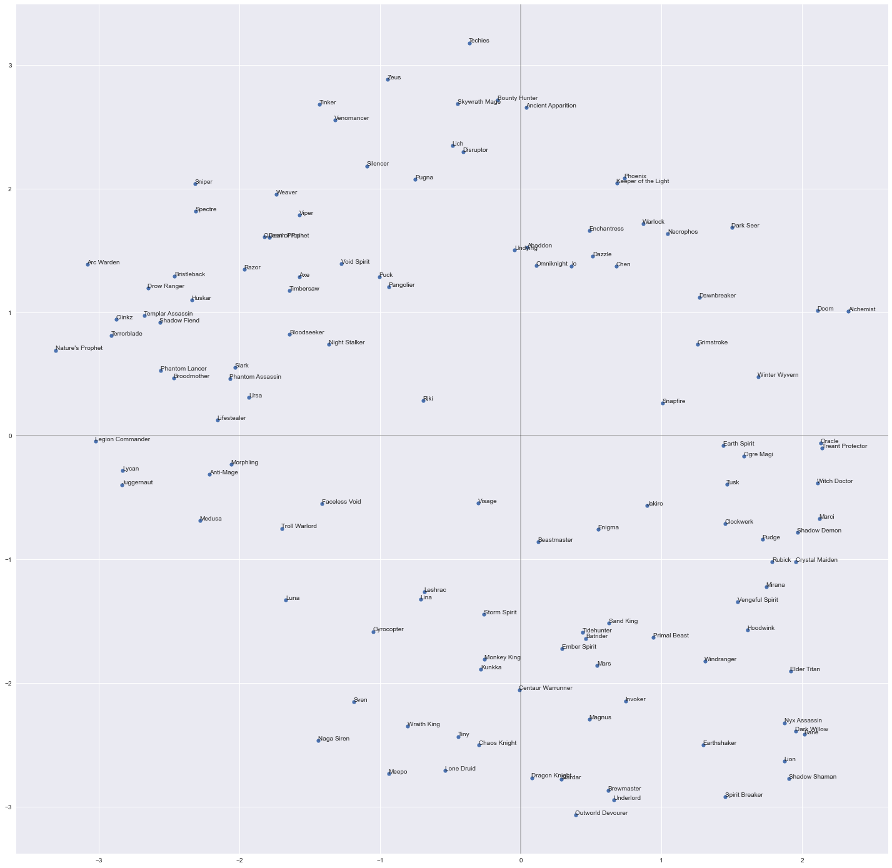

# Train pipelines

Folder with train pipelines

* train on public games - [public.py](public.py) / [public.ipynb](public.ipynb)
* train on league games - [league.py](league.py) / [league.ipynb](league.ipynb)

## Public overview

Quick comparison of two methods to ouctome (win) prediction - with pretrain and without pretrain:
ROCAUC without pretrain - 55.0 %
ROCAUC with pretrain    - 55.9 %
Δ - 0.9 %

Pretrain ideas:
*  Heroes -> Perfomance*:
    Feeds heroes, players, and rank tiers on input, excepts perfomance per team/player on output
* Perfomance -> Heroes:
    Feeds perfomance, excepts heroes per player on output, may uses face-recognition's losses

*Perfomance is post-match stats like total gold, xp e.t.c.

### Evaluation

#### Heroes -> Perfomance

| Hyper-parameter                        |        pretrain |                 |         pretrain |                  |
| :------------------------------------- | --------------: | --------------: | ---------------: | ---------------: |
| Hidden size                            |              32 |              32 |               64 |               64 |
| FFN inner hidden size                  |              64 |              64 |               64 |               64 |
| Attention Heads*                       |               4 |               4 |                4 |                4 |
| Encoder layer num                      |               4 |               4 |                4 |                4 |
| Dropout rate                           |             0.1 |             0.1 |              0.1 |              0.1 |
| Masking rate                           |            0.01 |            0.01 |             0.01 |             0.01 |
| Heroes embedding size                  |              16 |              16 |               16 |               16 |
| Players embedding size                 |              24 |              24 |               24 |               24 |
| Skip connection every N layer         |               4 |               4 |                4 |                4 |
| Batch size                             |            8192 |            8192 |             8192 |             8192 |
| Gradient Clipping                      |             1.5 |             1.5 |              1.5 |              1.5 |
| Weight Decay                           |            0.01 |            0.01 |             0.20 |             0.20 |
| Label smoothing                        |            0.15 |            0.15 |             0.10 |             0.10 |
| loss_weight: players_regression_output |            0.00 |            0.00 |             0.00 |             0.00 |
| loss_weight: l_output                  |            0.00 |            0.00 |             0.00 |             0.00 |
| loss_weight: r_output                  |            0.00 |            0.00 |             0.00 |             0.00 |
| loss_weight: teams_regression_output   |            0.25 |        *0.00* |             0.25 |         *0.00* |
| loss_weight: win_output                |            1.00 |            1.00 |             1.00 |             1.00 |
| Total trainable  params                |         114,015 |         114,015 |          359,359 |          359,359 |
| **Metric**                       | **Score** | **Score** |  **Score** |  **Score** |
| accuracy                               |          0.5377 |          0.5415 | **0.5419** |           0.5372 |
| auc                                    |          0.5513 |          0.5500 | **0.5598** |           0.5526 |
| log_loss                               |          0.6903 |          0.7054 | **0.6891** |           0.6906 |
| precision                              |          0.5283 |          0.5307 | **0.5343** |           0.5261 |
| recall                                 |          0.5589 |          0.5853 |           0.5347 | **0.5961** |

*TensorFlow's multihead attention, so this works differently from PyTorch

#### Perfomance -> heroes

Something like face recognition, with the same margin additive loss or just cross entropy

//TODO: fill this out

### Charts

###### Pickrate

num of games per hero in dataset

###### Heroes representations (visualizied with TSNE)

Embedding weights from `Heroes -> Perfomance*` model

Kernel weights `centroids` from `Perfomance -> Heroes` model

## League overview

...
